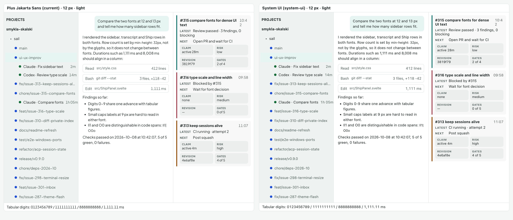
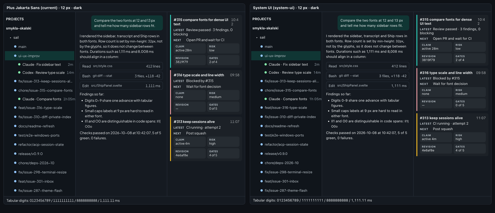
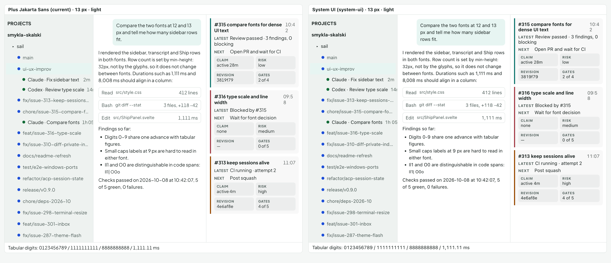
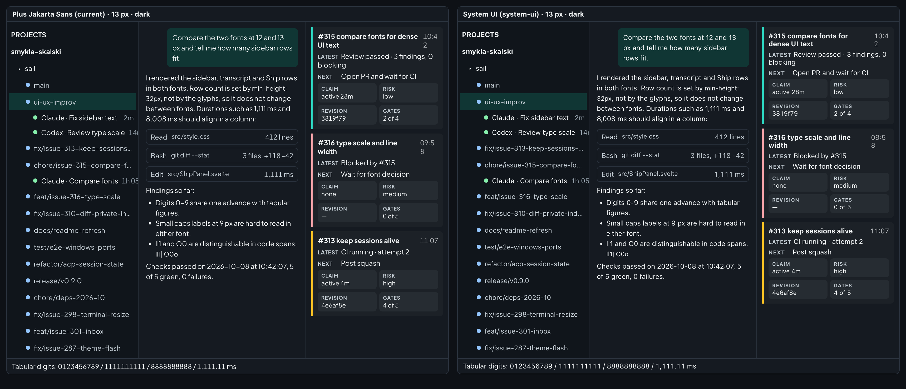

# Dense UI text font comparison (2026-10-08)

Spike for issue 315, input to the type scale in issue 316. The spike code was thrown away; only the captures and findings are kept.

## Decision needed

- Owner picks one: Plus Jakarta Sans (current, `--sui-font`) or the system UI font (`system-ui`).
- Recommendation: keep Plus Jakarta Sans and fix legibility through size, not family. Reasons below.
- Issue 316 consumes the decision as `font family` plus the measured sizes in the table.

## Method

- One static page loaded sui's `styles.css` and the app's `src/style.css`, so tokens and both themes are the real ones.
- Mock sidebar, transcript and Ship rows reuse the app's real metrics: sidebar rows `min-height: 32px` and the existing paddings, transcript line height 1.5, Ship items with the claim grid.
- Each capture shows both fonts side by side at the same size and theme: Plus Jakarta Sans left, `system-ui` right.
- Rendered in headless Chrome on macOS (`system-ui` resolves to SF Pro). The app runs in the Tauri webview, so subpixel rendering can differ slightly. Not checked in the live app.

## Captures

| Size  | Light                                                | Dark                                               |
| :---- | :--------------------------------------------------- | :------------------------------------------------- |
| 12 px |  |  |
| 13 px |  |  |

## Measurements

Measured in the page with `getBoundingClientRect`, per size.

| Metric                                                                                 | Jakarta 12 | System 12 | Jakarta 13 | System 13 |
| :------------------------------------------------------------------------------------- | ---------: | --------: | ---------: | --------: |
| Sidebar worktree row height (px)                                                       |         32 |        32 |         32 |        32 |
| Sidebar rows in the 640 px panel (below the header, project and session rows included) |         19 |        19 |         19 |        19 |
| Natural line height, "Ag" (px)                                                         |         15 |        15 |         16 |        16 |
| Tabular digit advance, 10 digits (px)                                                  |       72.0 |      75.6 |       78.0 |      81.1 |
| Proportional digit spread, 10x"0".."9" (px)                                            |  44.5-87.8 | 55.7-77.2 |  48.2-95.2 | 59.5-82.9 |
| Pangram + digits width (px)                                                            |        319 |       328 |        346 |       352 |
| Branch name `chore/issue-315-compare-fonts` (px)                                       |        188 |       180 |        204 |       193 |

## Findings

- Rows per screen: identical. Row height comes from `min-height: 32px`, which exceeds both fonts' natural line height at 12 and 13 px. Font family does not change density; only the min-height or padding does.
- Digit width: both fonts align with `font-variant-numeric: tabular-nums` (all ten digits share one advance). Without it both drift; Jakarta drifts more (the "1" is 44.5 vs the widest 87.8 over ten glyphs). The app sets `tabular-nums` only in the spawn views (`SpawnActivity.svelte`, `SpawnResponse.svelte`), not in the sidebar, transcript or Ship rows, so either font needs that rule there for durations, counts and timestamps. Jakarta's tabular digits are 4-5 percent narrower than SF.
- Prose width: Jakarta is about 2-3 percent narrower for prose and wider for path-like text (branch names 4-6 percent wider). Truncated branch rows clip a few characters earlier in Jakarta.
- Legibility at 12-13 px: both read cleanly in light and dark. The visible problem in the current UI is the 9-11 px chrome (uppercase labels, claim grid, timestamps), not the family. Uppercase 9 px labels are weak in either font.
- `I`, `l`, `1`, `|` and `O`, `0`: ambiguous in both fonts in prose; code spans use the monospace stack and are unaffected.
- Timestamps: in the mock Ship header the 12 px timestamp wraps ("10:4 / 2") in both fonts, a layout artifact to verify in the real app. Timestamps need `white-space: nowrap` plus `tabular-nums`.
- Portability: `system-ui` resolves to SF Pro (macOS), Segoe UI (Windows) or a distro default (Linux), so row widths, truncation and screenshots vary per user. Jakarta is bundled and identical everywhere. CI runs on Windows, so visual tests would drift with the system font.

## Recommendation for issue 316

- Keep Plus Jakarta Sans as `--sui-font`; no family change.
- Raise chrome text to 12 px minimum and transcript body to 13 px or more; sidebar rows stay at 32 px with 12-13 px text. Ship items and the claim grid are not 32 px rows and were not measured; raising their chrome to 12 px may wrap titles and timestamps, so check them in the real app.
- Add `font-variant-numeric: tabular-nums` to durations, counts, timestamps and the Ship claim grid.
- If the owner prefers the system font, the change is one token (`--sui-font` override in `src/style.css`) and row counts do not change; accept per-platform width variance.
